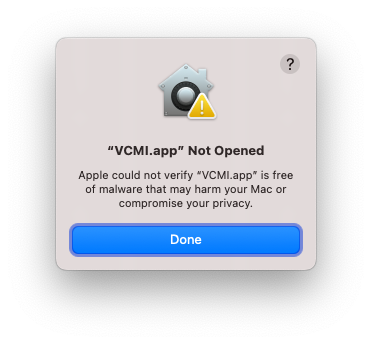
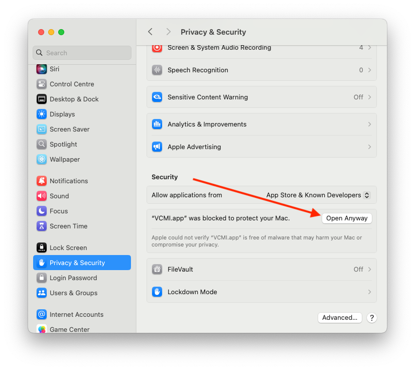

# Installing VCMI on macOS

This guide installs VCMI and imports the original Heroes III files it needs.

## Requirements

- macOS 10.15 or newer.
- An Intel or Apple silicon Mac. Download the package for your processor.
- Game data from **Heroes of Might and Magic III: Shadow of Death** or
  **Heroes III Complete**. The GOG Complete release is recommended.

> [!IMPORTANT]
> The Ubisoft *Heroes III HD Edition* is not compatible because it does not
> include the expansion data. VCMI is an engine and does not include copyrighted
> Heroes III game files.

## 1. Install VCMI

Choose one method:

- Download the appropriate package from the
  [latest GitHub release](https://github.com/vcmi/vcmi/releases/latest).
- Install the official Homebrew cask with `brew install --cask vcmi`.
- Install the VCMI tap with `brew install --cask vcmi/vcmi/vcmi`.
- For testing only, download an unstable build for
  [Intel](https://builds.vcmi.download/branch/develop/macos-intel/) or
  [Apple silicon](https://builds.vcmi.download/branch/develop/macos-arm/).

Open **VCMI Launcher** after installation.

### If macOS blocks the application

1. Try opening VCMI once.
2. Open **System Settings → Privacy & Security**.
3. Find the message about VCMI and select **Open Anyway**, then confirm.

On macOS 14 and earlier, you can instead Control-click the app, choose **Open**,
and confirm **Open** in the dialog. macOS 15 and later may only offer the
**Open Anyway** method.





## 2. Import Heroes III data

### From the GOG offline installer (recommended)

1. In your GOG library, download the **offline backup game installer** for
   Heroes III Complete. Download both its `.exe` and `.bin` files and keep them
   in the same directory.
2. In VCMI Launcher, choose the GOG installer import option.
3. Select the `.exe` file. The launcher finds the matching `.bin` file and
   extracts the required data automatically.


### From extracted or existing game files

Use VCMI Launcher's existing-files import option and select the directory that
contains `Data`, `Maps`, and `Mp3`.

Advanced users may instead copy or symlink those directories into:

```text
~/Library/Application Support/vcmi/
```

The `vcmibuilder` utility inside the application bundle can also import data
from supported installers and existing installations.

## 3. Finish setup and play

Follow the remaining launcher prompts. You may install recommended content from
its **Mods** page, then select **Start game**.

## Troubleshooting and updates

- If the launcher cannot find GOG data, confirm that the `.exe` and `.bin` belong
  to the same offline installer and are in the same directory.
- Stable releases are recommended for normal play. Save compatibility between
  different major VCMI versions is not guaranteed.
- For further help, see the [FAQ](https://vcmi.eu/faq/) or follow the
  [bug-reporting guide](Bug_Reporting_Guidelines.md).
